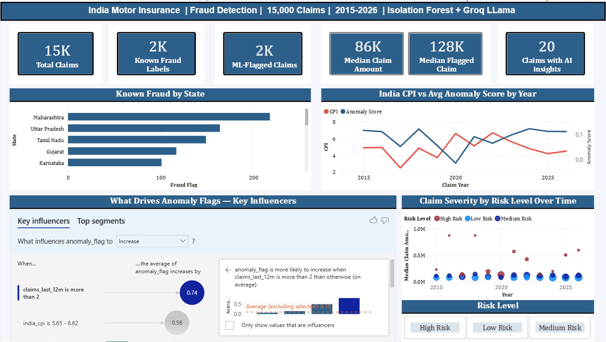
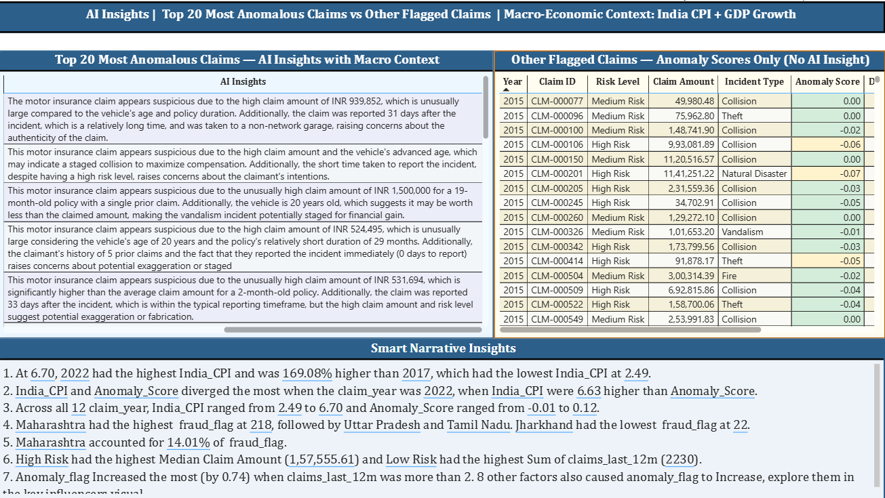

# From Score to Story: AI-Powered Fraud Detection in Power BI

## Overview

Insurance fraud is inherently difficult to identify because fraudulent claims are rare and often hidden within large volumes of legitimate claims.

This project demonstrates an end-to-end fraud detection workflow that combines anomaly detection, statistical risk scoring, explainable AI, and interactive reporting. The objective is not just to identify suspicious claims, but to transform anomaly scores into investigator-readable narratives that help analysts understand why a claim was flagged.

The solution uses Isolation Forest to identify anomalous claims, Power BI to visualize risk patterns, and a Groq-hosted Llama model to generate plain-language explanations for the highest-risk cases.

---

## Key Features

- Synthetic insurance claims dataset calibrated using industry and macroeconomic references
- Isolation Forest anomaly detection
- Distribution-based risk scoring
- Power BI fraud monitoring dashboard
- Power BI Key Influencers analysis
- LLM-generated claim narratives using Groq-hosted Llama
- Economic context using inflation and GDP growth indicators
- Fully reproducible Python workflow

---

## Statistics Corner

Anomaly detection rests on a simple statistical idea: fraud is rare, and rare events are easier to isolate than to classify.

In statistics, observations that fall unusually far from the rest of the data are called outliers. Traditional techniques such as Z-scores and Interquartile Range (IQR) identify unusual values in a single variable. However, real-world fraud often emerges from combinations of features that may appear normal individually but become suspicious when viewed together. Anomaly detection extends the concept of outlier analysis by evaluating patterns across multiple variables and identifying observations that deviate from normal behaviour.

---

## Solution Architecture

```text
Synthetic Claims Data
          ↓
Isolation Forest
          ↓
Risk Scoring
          ↓
Groq Llama Explanations 
          ↓
Key Influencers
          ↓
Power BI Dashboard
```

## Dataset Generation

This project uses synthetic motor insurance claims data.

The dataset was generated using Python and statistically calibrated using publicly available industry and economic references.

### Insurance Domain References

- IRDAI Annual Report 2023-24
- Claims ratios
- Vehicle mix
- Industry structure
- Estimated fraud prevalence

### Economic References

- IMF World Economic Outlook (April 2026)
- India CPI Inflation
- India GDP Growth

Synthetic data generation was assisted by Claude, which was used to help calibrate statistical parameters and construct realistic claim-generation logic. The objective was not to reproduce real customer data but to create a realistic environment for experimentation and model development.

No real customer data was used in this project.

---

## Why Isolation Forest?

- No labelled fraud data is required
- Scales efficiently to large datasets
- Produces continuous anomaly scores
- Works well when fraudulent cases represent a small minority of observations

---

## Explainable AI Layer

Most fraud systems stop at generating a score.

This project extends the workflow by converting anomaly scores into investigator-readable narratives.

Only the 20 most extreme claims in the anomaly distribution are sent to the LLM for analysis.

---

## Report Screenshots





---

## Technology Stack

### Data Science
- Python
- Pandas
- NumPy
- Scikit-learn

### Machine Learning
- Isolation Forest

### Explainable AI
- Groq API
- Llama 3.1

### Visualization
- Power BI

---

## Production Considerations

- Store API keys in environment variables
- Avoid sending real customer data to public APIs
- Separate machine learning pipelines from Power BI
- Use a database or lakehouse as the system of record

---

## Additional Resources

- Blog Post: [From Score to Story: AI-Powered Fraud Detection in Power BI](https://mschethana.github.io/posts/ai-powered-fraud-detection/)
- Power BI Dashboard Screenshots: dashboard_images/
- Presentation Slides: presentation/

---

## Author

Chethana M S

Project created as a personal exploration of how anomaly detection and generative AI can be combined to improve fraud investigation workflows.